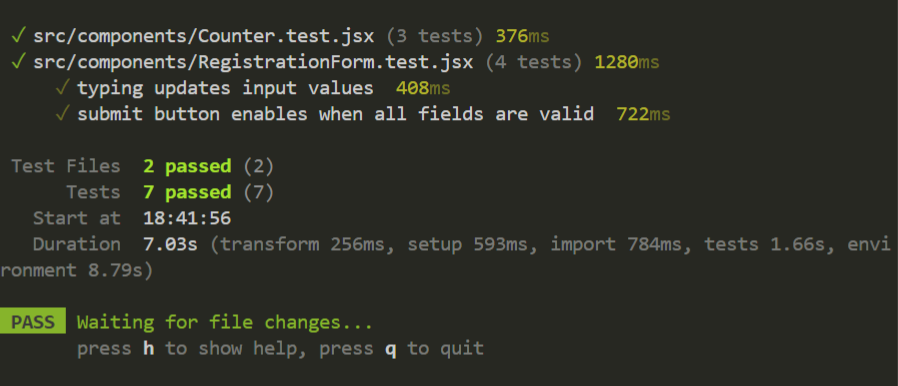

# React Unit Testing

A small React app built with Vite to practice component testing. The app includes a counter section and a registration form section.

## Concepts Learned

- Rendering React components in a test environment.
- Finding elements by accessible text, labels, and roles.
- Testing button clicks with user interactions.
- Checking state updates after incrementing and decrementing the counter.
- Testing form input changes.
- Validating form behavior, including disabled and enabled submit states.
- Showing validation messages when the password is too short.
- Using `jsdom` to simulate a browser-like environment during tests.

## Tech Used

- React
- Vite
- Vitest
- React Testing Library
- `@testing-library/user-event`
- `@testing-library/jest-dom`
- jsdom

## Tested Components

- `Counter.jsx`
- `RegistrationForm.jsx`

## Run The Project

```bash
npm install
npm run dev
```

## Run Tests

```bash
npm run test
```

## Build

```bash
npm run build
```
